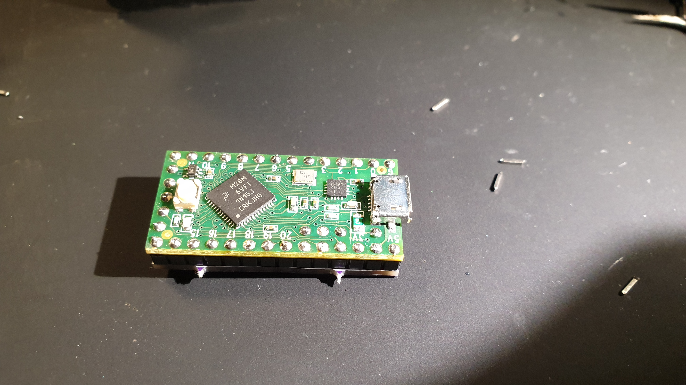
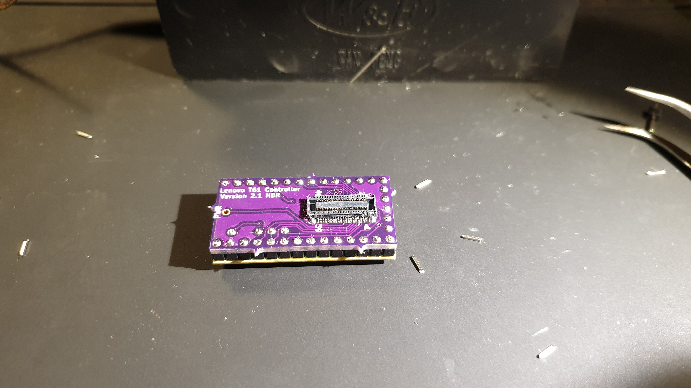

# USB Teensy T61 Controller

Based on [thedalles77](https://github.com/thedalles77/)'s version just smaller

## BOM

| Reference        | Part Number           | Description  |
| ------------- |:-------------:| -----:|
| J1 | 0543630489 | 40 Pin FPC keyboard connector (Or pull off a scrap board) |
| U1 | Teensy LC |  |                               
| U2 | TLV810MDBZR | 4.38 Volt Reset Generator SOT23 |
| Q1 | BSS138 | NFET SOT23 |
| Q2 | BSS138 | NFET SOT23 |
| R1 | ERJ-PA3J103V | 0603 10K Resistor |
| R2 | ERJ-PA3J103V | 0603 10K Resistor |
| R3 | ERJ-PA3J103V | 0603 10K Resistor |
| R4 | ERJ-PA3J103V | 0603 10K Resistor |
| C1 | 06035C104KAT2A | 0603 0.1uF Capacitor |
| C2 | 06035C104KAT2A | 0603 0.1uF Capacitor |

## Images

